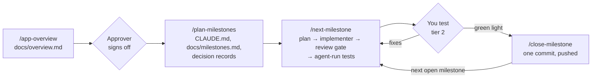

# milestone-loop

A Claude Code plugin that turns an app idea into shipped work, one
milestone at a time, with quality gates the agent cannot skip.

## Why

Letting an agent write a whole app in one go produces code nobody has
checked. milestone-loop splits the work into small milestones and runs
each one through the same loop:

- **Gates.** Nothing is planned before a human (the *approver*) signs off
  on a plain-language overview of the app. Nothing is closed before the
  user gives a green light after testing. On a solo project, you are the
  approver.
- **Delegated implementer.** The session that plans and judges does not
  write the code. A subagent implements the approved plan, and the session
  re-runs the full build and test suite itself: a green claim in a report
  is not trusted until it is reproduced.
- **Adversarial review.** Before you see anything, three fresh reviewers
  attack the milestone's diff, one lens each: bugs and correctness,
  overengineering and leftovers, scope and project-rule compliance. They
  get the diff, the acceptance criteria and CLAUDE.md, never the author's
  reasoning. Surviving findings are fixed; at most two rounds. At
  planning time you choose whether the gate runs on every milestone (the
  default), only on tagged ones, or on none.
- **Two-tier testing.** The agent drives every test step it can (browser,
  API, database, stack tooling) and records what it observed. You get only
  the steps that need a human: a real device, a physical action, a
  subjective call.
- **Handoff.** A milestone that outlives its session leaves a handoff file
  (done, remaining, decisions, gate status, next step). The next session
  resumes from it instead of re-reading the scope from scratch.

## Workflow



Each step is one skill. Start each in a fresh session (`/clear` first),
except `/close-milestone`, which runs in the same session as the
`/next-milestone` or `/next-group` it closes:

| Skill | What it does |
|---|---|
| `/app-overview` | Writes `docs/overview.md`: goal, audience, requirements (`R-01`…), out of scope. Records the project's `Language:`. |
| `/plan-milestones` | After sign-off: writes the milestone queue, CLAUDE.md rules, decision records and system docs. |
| `/find-parallel` | Finds milestones that can run at the same time and tags them as groups (`Group: G-02`). `/plan-milestones` already does this for a new plan. |
| `/next-milestone` | Plans the first open milestone, delegates it, runs the review gate and the agent-run tests, hands you the rest. Commits only a local `wip` checkpoint. |
| `/next-group` | **Beta.** Runs a group of milestones at once: one plan approval, an implementer per milestone, a review gate per milestone, one manual test script for the whole group. |
| `/close-milestone` | After your green light: records deviations and retro, squashes the checkpoint, commits and pushes one commit per milestone. |
| `/hotfix` | Fixes a bug found in real use, outside the milestone cycle, with a one-reviewer gate. |
| `/replan` | Revises the milestone queue: reorder, split, add, drop. |
| `/milestone-status` | Read-only dashboard of the queue. |

Milestone work goes to an integration branch: `dev` by default, created
by the first skill that commits. To use another branch, put an
`Integration branch: <name>` line in CLAUDE.md before running
`/app-overview`. Unless the integration branch is `main`, `main` changes
only when the last milestone closes, and only with your yes.
`/plan-milestones` asks whether milestones close through a direct push or
a pull request (recommended for team work) and records the answer as a
`Commit mode: direct` or `Commit mode: pr` line in CLAUDE.md; edit that
line to switch.
`/app-overview` also asks whether commits are pushed to the remote or
stay local only, recorded as `Push: yes` or `Push: no` (local only means
no pull requests).

## Parallel groups

> **Beta.** `/next-group` is new and less tested than `/next-milestone`. Each member can always run on its own with `/next-milestone` instead.

Manual testing is the most expensive step of the loop, and each milestone
costs you a test session. A group of two or three milestones costs one.

- `/plan-milestones` tags groups of independent milestones as it writes
  the plan: no dependency between them, and no overlap in the files they
  are expected to touch. On an existing project, or after `/replan`,
  `/find-parallel` does the same.
- `/next-group` runs a group. You approve one plan for all members. Each
  member gets its own implementer in its own git worktree, all working at
  the same time, and its own review gate. The session then merges them,
  runs the full build and test suite on the combination, and drives every
  test step it can.
- You get one script of at most 5 manual steps for the whole group,
  ranked by risk: checks only a human can make come first, and steps
  that share a setup are merged into one walkthrough. Criteria left out
  are listed with the automated check that covers them, so you can pull
  any of them back in.
- `/close-milestone` closes the group with one commit per milestone.

On Unity projects the members are implemented one after another in one
tree (one Editor), but you still approve, test and close them together.

## Install

In Claude Code:

```
/plugin marketplace add gabesf/milestone-loop
/plugin install milestone-loop@milestone-loop
```

Check that `/app-overview` shows up in the `/` menu (restart Claude Code
if it doesn't). If another plugin defines a skill with the same name, use the
namespaced form, e.g. `/milestone-loop:app-overview`.

## Quickstart (5 minutes)

About 5 minutes gets you to a written overview. Planning and each
milestone take longer: they are where you answer questions and test.

You need a git repository with a remote you can push to, and at least
one commit on `main`: the skills commit and push their docs as they go,
on a `dev` branch they create from `main`.

1. Create or open the project and start Claude Code in it:
   ```
   mkdir my-app && cd my-app && git init -b main
   git remote add origin <your-remote-url>
   git commit --allow-empty -m "init" && git push -u origin main
   claude
   ```
2. Run `/app-overview`. Describe the app in a few sentences, attach any
   mockups, and answer its questions. It writes `docs/overview.md`, asks
   which language the docs should use, and commits both.
3. Read `docs/overview.md` as the approver (or send it to yours). To
   change it, run `/app-overview` again and choose to revise. Sign-off is
   the gate.
4. `/clear`, switch to the top-tier model (`/model`, see
   [Model tiers](#model-tiers)), then run `/plan-milestones`. It settles
   the stack with you (`web` means Supabase + Next.js, see
   [Stacks](#stacks)), asks whether to run the review gate on every
   milestone, and writes `docs/milestones.md` with small milestones mapped
   to the requirement IDs.
5. `/clear`, set `/model` to the tier the milestone is tagged with
   (standard if untagged), then run `/next-milestone`. It stops and asks
   you to switch if the session's model is below that tier. Approve its
   plan and watch the loop run. At the end it gives you a short list of
   manual test steps.
6. Test, report what you found in the same session, and once it works,
   run `/close-milestone` there. Repeat from step 5 for the next
   milestone.

Check where things stand at any time with `/milestone-status`.

## Model tiers

The skills speak of two tiers, not model names: **top** (planning and
algorithm-heavy milestones) and **standard** (conventional milestones,
implementers, reviewers). Defaults are `fable` and `opus`. Override them
in your project's CLAUDE.md:

```
Model tiers: top = opus, standard = opus
```

Optional lines: `Model cap: standard` (never use the top tier),
`Model floor: <alias>` (the weakest model accepted for `/next-milestone`
and implementers, default: the standard tier), `Implementation model:
<alias>`. Reviewers run on the standard tier's model.

## Stacks

Stack references add rules per stack; the generic skills load the ones
named by CLAUDE.md's `Stack:` line. A project that mixes stacks lists them
all (`Stack: mechanical, electronics, web`) and gets each one's rules. Any
other stack runs on the generic rules alone.

- **`web`** (Supabase + Next.js, not any web app): migrations only
  through the Supabase CLI against a local Docker stack, mobile testing
  rules for PWAs. For another web stack, record a different `Stack:`
  name.
- **`unity`**: scene and prefab edits only through MCP for Unity, a
  runtime control panel for tunable values.
- **`mechanical`** (machines, sheet metal, 3D-printed parts; CAD in
  FreeCAD through its MCP server): designs only for the fabrication
  processes the user has, re-runnable geometry scripts as the source of
  truth, interference and clearance checks after every change, one design
  decision at a time, fabrication files only after the previews are
  approved. Simulations (FEM in FreeCAD, MuJoCo for mechanisms) answer
  one question each, are validated against a hand calculation and are
  checked for convergence.
- **`electronics`** (ESP32/Arduino-class firmware with PlatformIO): one
  pin header, host-tested logic, every output's safe state on reset,
  hang and power loss, sensors checked against a reference, flashing only
  an unambiguous board.

Both physical stacks share `physical-build`: milestones are tagged
`Kind: design` (ends in a verified package) or `Kind: build` (the user
makes and measures the object; it closes with an as-built record), waiting
for parts happens between milestones, every testing doc lists its hazards,
and anything that can harm a living being gets its failsafe first.

## Companions

None of these are needed for the core loop. The first is optional
everywhere; the others are needed only by the stack or testing step that
names them.

| Companion | Used by | Source |
|---|---|---|
| `/grill-me` | Optional stress-test of the overview and the plan (the skills offer to install it) | [mattpocock/skills](https://github.com/mattpocock/skills) |
| Claude in Chrome | Agent-run browser tests on web projects | [claude.com/chrome](https://claude.com/chrome) |
| Supabase CLI | Required by the `web` stack reference | [supabase.com/docs/guides/cli](https://supabase.com/docs/guides/cli) |
| Docker | Required by the `web` stack reference (local Supabase stack) | [docker.com](https://www.docker.com/get-started/) |
| MCP for Unity | Required by the `unity` stack reference, with the Unity Editor open | [CoplayDev/unity-mcp](https://github.com/CoplayDev/unity-mcp) |
| FreeCAD MCP | Required by the `mechanical` stack reference, with FreeCAD open | [neka-nat/freecad-mcp](https://github.com/neka-nat/freecad-mcp) |
| MuJoCo | Optional, for mechanism simulation in the `mechanical` stack reference | [mujoco.org](https://mujoco.org) |
| PlatformIO Core | Required by the `electronics` stack reference | [platformio.org](https://platformio.org/install/cli) |

## License

[MIT](LICENSE)
